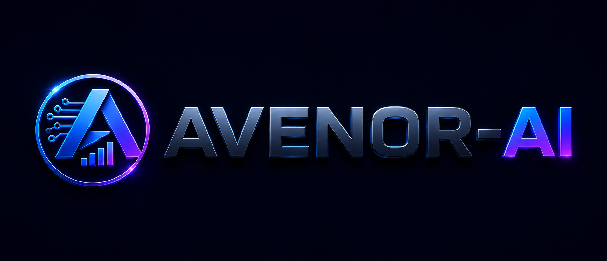
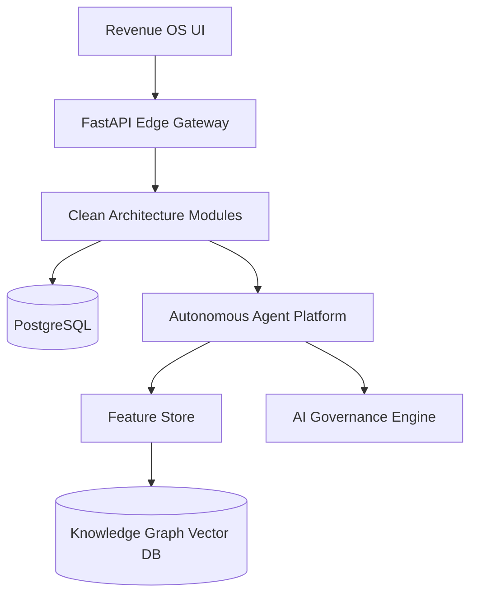

<div align="center">
  
  <h1>AVENOR-AI</h1>
  <h3>AI-Native Predictive Revenue Intelligence Platform</h3>
  <p>Become the world's AI operating system for B2B Revenue Intelligence.</p>
</div>

---

## 📖 Project Overview
AVENOR-AI is a hyperscale, enterprise-grade Revenue Intelligence Platform. It replaces legacy CRMs (like Salesforce) and static data providers (like ZoomInfo) with a unified, autonomous **Intelligence Cloud**. By natively integrating a vector-based Knowledge Graph with Foundation Revenue Models, AVENOR-AI empowers Go-To-Market teams to operate with autonomous precision.

## 🎯 Mission
Help revenue teams know exactly **WHO** to contact, **WHEN** to contact them, **WHY** they are likely to buy, and **WHAT** actions should be taken next using explainable AI.

## 🔭 Vision
Become the world's AI operating system for B2B Revenue Intelligence—a true Cognitive Digital Twin of the enterprise revenue engine.

---

## ⚡ Platform Highlights

- **AI-Native Architecture**: Built from the ground up on a vector-native Knowledge Graph, discarding legacy relational constraints.
- **Enterprise Intelligence**: 12 proprietary intelligence engines actively crawling and resolving global signals (Funding, Hiring, Intent).
- **Autonomous Agents**: Instead of providing static lists, AVENOR's Agents autonomously research buying committees and draft personalized outreach.
- **Constitutional AI Safety**: Every AI decision is mathematically evaluated against strict Hallucination Detection constraints and Human-In-The-Loop approval queues.

---

## 🛠️ Technology Stack
- **Frontend**: React, Next.js, TailwindCSS (Glass-card UI)
- **Backend Edge**: Python, FastAPI, Celery
- **Data Persistence**: PostgreSQL, Redis, Vector Database
- **AI/ML Layer**: PyTorch, HuggingFace, Enterprise Feature Store
- **Infrastructure**: Kubernetes, Terraform, Multi-Region Active-Passive Routing

---

## 🏗️ Architecture Overview



*For a deep dive, read our [Architecture Guide](docs/ARCHITECTURE.md).*

---

## 🚀 Quick Start & Installation

To spin up the local development environment:

```bash
git clone git@github.com:Avenor/Avenor-AI.git
cd Avenor-AI
cp .env.example .env

# Start Persistence Layer (PostgreSQL, Redis, Vector DB)
docker-compose up -d

# Start API Backend
python -m venv venv
source venv/bin/activate
pip install -r requirements.txt
uvicorn app.main:app --reload

# Start Frontend
cd frontend
npm install
npm run dev
```
*See the [Developer Guide](docs/DEVELOPER_GUIDE.md) for full instructions.*

---

## 📂 Repository & Documentation Structure

The definitive documentation suite is located in the `docs/` directory.

| Documentation | Description |
|--------------|-------------|
| 📐 [**Architecture**](docs/ARCHITECTURE.md) | High-level system design, Data Flow, Tech Stack. |
| 🧩 [**Modules**](docs/MODULES.md) | Core components: Revenue OS, Copilot, Marketplace. |
| 🗺️ [**Roadmap**](docs/ROADMAP.md) | The 10-phase engineering roadmap and future vision. |
| 🗄️ [**Database**](docs/DATABASE.md) | ER Diagrams, Partitioning, Identity Resolution. |
| 🧠 [**AI Architecture**](docs/AI_ARCHITECTURE.md) | Knowledge Graph, Feature Store, Agents, Reasoning. |
| 🛡️ [**Security**](docs/SECURITY.md) | RBAC, SOC2, Compliance Cloud, Workspace Isolation. |
| 🔌 [**API Reference**](docs/API.md) | Public API, Webhooks, CRM API, OAuth2. |
| 🚀 [**Deployment**](docs/DEPLOYMENT.md) | Kubernetes, CI/CD, Multi-Region Failover. |
| 💻 [**Developer Guide**](docs/DEVELOPER_GUIDE.md) | Local Setup, Testing Strategy, Coding Standards. |
| 📈 [**Business Strategy**](docs/BUSINESS.md) | TAM, Pricing, ICP, Competitive Defensibility. |
| ❓ [**FAQ**](docs/FAQ.md) | Frequently Asked Questions. |
| 📖 [**Glossary**](docs/GLOSSARY.md) | Terminology definitions. |

---

## 🛣️ Short Roadmap
- **Q3 2026**: General Availability of the AI Governance Platform.
- **Q4 2026**: Multi-Region K8s Failover deployments.
- **Q1 2027**: Launch of the Enterprise Multi-Agent Platform (Phase 10).

---

## 🤝 Contributing
Please read [CONTRIBUTING.md](CONTRIBUTING.md) for details on our code of conduct and the process for submitting pull requests to us.

## 📄 License
This project is licensed under the MIT License - see the [LICENSE](LICENSE) file for details.
