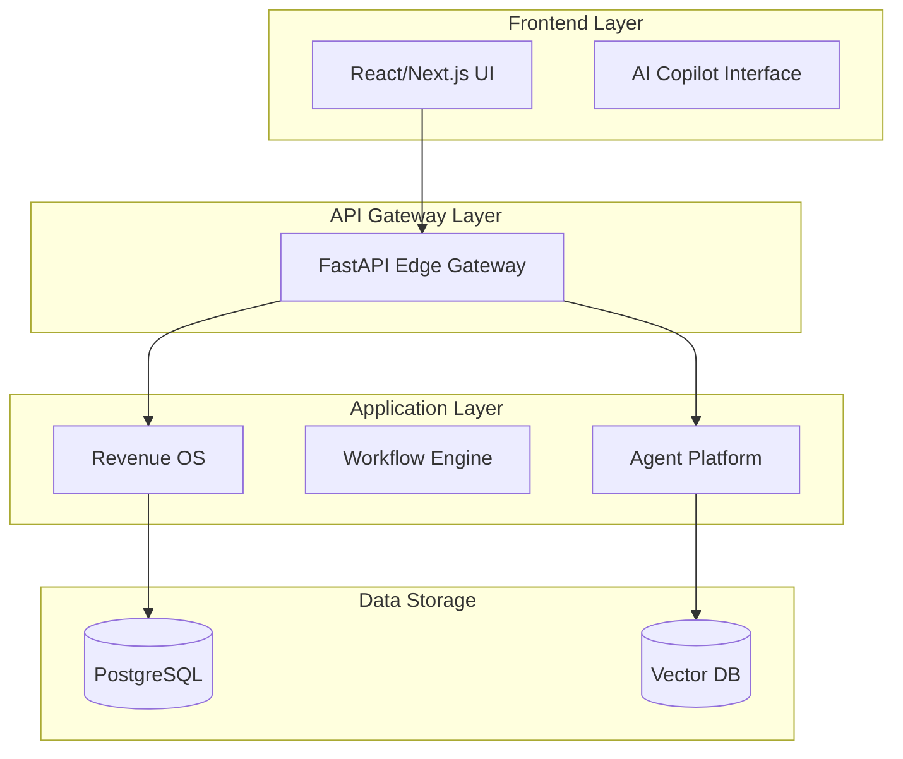

[🏠 Home](../README.md) | [Next: Modules ➡️](MODULES.md)
<br>

# Architecture Overview

AVENOR-AI is built on a highly modular, scalable, and secure microservices-oriented architecture using **Clean Architecture** principles and **Domain-Driven Design (DDD)**.

## Table of Contents
1. [System Design & Data Flow](#system-design--data-flow)
2. [Technology Stack](#technology-stack)
3. [Repository Structure](#repository-structure)

---

## 1. System Design & Data Flow



## 2. Technology Stack

| Domain | Technology | Justification |
|--------|------------|---------------|
| **Frontend** | React / Next.js | Component-driven architecture, SSR. |
| **Backend API** | Python / FastAPI | Native asynchronous support, ML integration. |
| **Database** | PostgreSQL | ACID compliance, transactional integrity. |
| **Caching** | Redis | Rate limiting, fast memory context. |
| **Infrastructure**| Kubernetes | Multi-region scaling and isolation. |

## 3. Repository Structure

```text
Avenor-AI/
├── app/                        # Main Application Code
│   ├── modules/                # Domain-Driven Modules (e.g. ai_governance)
│   ├── core/                   # Global cross-cutting concerns
│   └── main.py                 # Entrypoint
├── frontend/                   # React/Next.js Application
├── tests/                      # Global Test Suite
├── docs/                       # Official Documentation Suite
└── infrastructure/             # Terraform / K8s manifests
```

<br>

---
[🏠 Home](../README.md) | [Next: Modules ➡️](MODULES.md)
