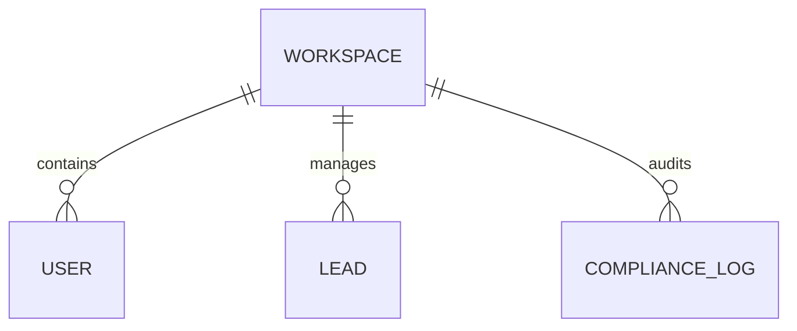

[⬅️ Prev: Roadmap](ROADMAP.md) | [🏠 Home](../README.md) | [Next: AI Architecture ➡️](AI_ARCHITECTURE.md)
 

# Database Architecture

## Table of Contents
1. [Persistence Technologies](#persistence-technologies)
2. [ER Diagram](#er-diagram)
3. [Scaling & Sharding](#scaling--sharding)

---

## 1. Persistence Technologies
- **PostgreSQL**: Transactional data (Users, Billing, CRM Pipeline).
- **Vector DB**: High-dimensional embeddings and Knowledge Graph relationships.
- **Redis**: Rate limiting, caching, and background queues.

## 2. ER Diagram

## 3. Scaling & Sharding
- **Horizontal Partitioning**: PostgreSQL partitioned by `workspace_id`.
- **Time-Series Partitioning**: Append-only tables partitioned by month for easy TTL drops.
- **Active-Passive**: Cross-region database replication for zero downtime disaster recovery.

 

---
[⬅️ Prev: Roadmap](ROADMAP.md) | [🏠 Home](../README.md) | [Next: AI Architecture ➡️](AI_ARCHITECTURE.md)
