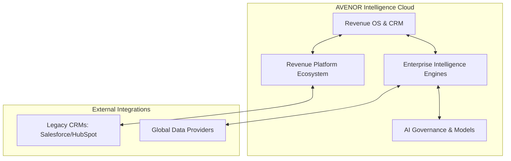

  
  <h1>AVENOR-AI</h1>
  <h3>AI-Native Predictive Revenue Intelligence Platform</h3>
  
Become the world's AI operating system for B2B Revenue Intelligence.

---

## 1. Executive Overview

### The Problem
Modern B2B revenue teams (Sales, Marketing, and Customer Success) are drowning in fragmented data. CRMs act merely as static filing cabinets, requiring massive manual data entry. Go-to-market teams spend 60% of their time researching accounts, guessing buying intent, and configuring complex manual workflows across disparate tools (ZoomInfo, Outreach, Salesforce). There is no unified "brain" connecting global market signals with internal pipeline data to drive autonomous revenue generation.

### Our Vision
Become the world's AI operating system for B2B Revenue Intelligence. We envision a future where autonomous AI agents seamlessly orchestrate revenue operations—eliminating manual research and empowering human sellers to focus entirely on high-value strategic relationships.

### Our Mission
Help revenue teams know exactly:
1. **WHO** to contact.
2. **WHEN** to contact them.
3. **WHY** they are likely to buy.
4. **WHAT** actions should be taken next using explainable AI.

### Target Customers
AVENOR-AI is built for Enterprise and Mid-Market B2B organizations, specifically targeting:
- **Chief Revenue Officers (CROs)** seeking predictable forecasting and pipeline generation.
- **VP of Sales / RevOps** requiring unified data architectures and automated workflows.
- **Account Executives (AEs) & SDRs** needing hyper-personalized, AI-researched account dossiers and buying signals.

### Business Model
Enterprise SaaS (Software-as-a-Service).
- **Seat-based Licensing**: Core platform access for GTM teams.
- **Consumption-based AI Compute**: Usage-based pricing for AI Agent execution, Feature Store inference, and Knowledge Graph traversals.
- **Data Enrichment Add-ons**: Premium global signals (Funding, Hiring, Intent).

### Competitive Position & Differentiation
Unlike legacy data providers (ZoomInfo, Apollo) that supply static lists, or legacy CRMs (Salesforce) that require manual operation, AVENOR-AI is an **Intelligence Cloud**. 
- **AI-Native**: Built from the ground up on a vector-native Knowledge Graph, not relational tables.
- **Autonomous Agents**: Instead of providing a list of contacts, AVENOR's Autonomous SDR agents research the buying committee, draft hyper-personalized outreach based on real-time signals (e.g., recent funding, executive changes), and orchestrate the workflow.
- **Privacy-Preserving Collective Intelligence**: A proprietary framework that identifies market-wide revenue patterns across enterprises without exposing confidential PII or customer data.

### Long Term Vision
AVENOR-AI will evolve from a Predictive Revenue Intelligence Platform into the **Global Revenue Network**—a completely autonomous Enterprise Digital Twin capable of simulating revenue outcomes and operating self-driving GTM motions.

---

## 2. Platform Overview

The AVENOR-AI platform is a hyperscale, multi-region distributed system organized into distinct logical clouds. 

### Core Platform Topology

### 1. Revenue OS
The central operating system for human users. It replaces legacy CRMs with a dynamic, AI-driven interface. It includes Pipeline Management, Lead Scoring, Forecasting, and the interactive AI Copilot.

### 2. Enterprise Intelligence
A massive suite of 12 dedicated intelligence engines (Company, Contact, Technology, Buying Committee, Funding, Hiring, Executive, Competitive, Market, Industry, Global Signals, and Identity Resolution). These engines ingest petabytes of unstructured global data and map it into the central **Knowledge Graph**.

### 3. Revenue Platform Ecosystem
The extensibility layer. It features the Integration Hub (syncing bidirectionally with HubSpot, Salesforce), the Public API, Webhook Platform, Workflow Builder, and the marketplace for third-party applications.

### 4. AI Governance & Intelligence Cloud
The deep backend powering the predictive logic. It houses our proprietary Foundation Revenue Models, the Enterprise Feature Store (for ultra-low latency ML inference), the AI Model Platform (MLOps), and the strict AI Governance Platform ensuring all autonomous decisions are safe, explainable, and unbiased.

---

### System Interconnection

> [!NOTE]
> Every subsystem in AVENOR-AI communicates via strict Clean Architecture boundaries. 

1. **Ingestion**: Global Data Providers stream signals into the `Global Data Platform`.
2. **Resolution**: The `Identity Resolution Engine` maps raw signals to canonical entities in the `Knowledge Graph`.
3. **Feature Engineering**: The `Feature Store` computes real-time vectors (e.g., `company_momentum_score`).
4. **Inference**: The `AI Model Platform` uses these features to predict Buying Windows and Churn Risk.
5. **Orchestration**: The `Workflow Engine` and `Agent Builder` trigger autonomous actions based on these predictions.
6. **Delivery**: The `Revenue OS` and `Copilot` present the explainable insights to the human Account Executive.
7. **Governance**: Before any action is executed (e.g., sending an email), the `AI Governance Platform` validates it for hallucinations and routes high-risk actions to a Human-in-the-Loop approval queue.
